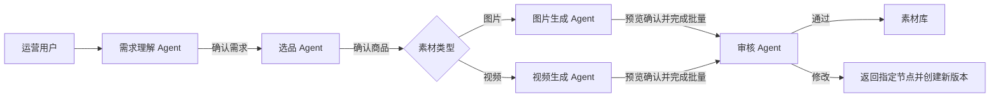

# AI 广告素材生成平台｜五大 Agent 详细设计

> 文档版本：V1.0  
> 适用范围：产品设计、算法/后端开发、前端联调、测试验收、作品集展示  
> 核心约束：系统固定由五个业务 Agent 组成；编排、知识检索、Prompt 编译、模型路由、合规规则和媒体处理均为平台能力，不再拆分为 Agent。

---

## 1. 设计结论

平台只设置以下五个 Agent：

| Agent | 核心职责 | 明确边界 | 关键确认门 |
|---|---|---|---|
| 需求理解 Agent | 把自然语言诉求转成结构化投放需求 | 不选品、不写创意、不创建任务 | 用户确认需求快照 |
| 选品 Agent | 硬过滤、召回、排序商品并解释理由和风险 | 不替用户最终选择、不改商品事实 | 用户确认商品与卖点 |
| 图片生成 Agent | 完成图片创意、文案、构图、预览与批量生产 | 不处理视频；一次预览只生成 1 张 | 用户确认唯一预览 |
| 视频生成 Agent | 完成脚本、分镜、镜头、组件、预览与批量生产 | 不处理图片；一次预览只生成 1 条 | 用户确认完整预览 |
| 审核 Agent | 检查质量、事实、品牌和合规，给出可解释建议 | 不替代必须由人工完成的最终审核 | 按风险与策略完成人工决定 |

编排器不是第六个 Agent。它是确定性平台服务，负责状态机、门禁、事件、快照、重试、超时和 Agent 交接，不进行业务内容决策。



---

## 2. 全体 Agent 的统一运行契约

### 2.1 统一输入上下文

每次 Agent 调用都由编排服务组装 `agent_context`，禁止 Agent 自行从会话文本猜测当前状态。

| 字段 | 类型 | 说明 |
|---|---|---|
| tenant_id | string | 当前租户，所有知识和工具调用必须按租户隔离 |
| user_id | string | 当前操作者，用于权限和审计 |
| session_id | string | 生成会话 ID |
| stage | enum | 当前业务阶段 |
| stage_snapshot_id | string? | 上一确认快照 |
| media_type | IMAGE / VIDEO / UNKNOWN | 素材类型；未确认时为 UNKNOWN |
| confirmed_context | object | 已由用户确认、不可静默改写的字段 |
| draft_context | object | 当前阶段可修改草稿 |
| knowledge_snapshot_id | string | 本轮使用的知识版本集合 |
| policy_snapshot_id | string | 本轮规则版本 |
| permissions | string[] | 当前 Agent 可调用的工具白名单 |
| user_message | string | 用户最新输入 |
| attachments | object[] | 已完成安全扫描与授权判断的附件 |
| request_id | string | 全链路追踪 ID |

### 2.2 统一输出信封

所有 Agent 必须输出同一层信封，业务内容放在 `payload` 中。

```json
{
  "agent_name": "product_agent",
  "schema_version": "1.0",
  "assistant_message": "为你筛选出 3 个可投商品，请确认主推商品。",
  "payload": {},
  "patch": [],
  "citations": [],
  "validation": {
    "status": "PASS",
    "missing_fields": [],
    "conflicts": [],
    "warnings": []
  },
  "next_action": {
    "type": "REQUEST_CONFIRMATION",
    "target_stage": "PRODUCT_CONFIRMATION"
  },
  "requires_confirmation": true,
  "confidence": 0.92
}
```

约束：

1. 输出必须通过 JSON Schema 校验；失败时最多自动修复 2 次。
2. 对业务草稿的修改必须使用 RFC 6902 JSON Patch，不直接覆盖整个对象。
3. `assistant_message` 只负责向用户解释，系统不能从自然语言反向解析业务字段。
4. 关键结论必须提供 `citations`，至少包含知识条目、字段、版本和证据片段。
5. `confidence` 低于阶段阈值时不能自动推进，必须澄清或交给人工。
6. Agent 不能修改 `confirmed_context`；需要变更时必须发起“返回阶段”请求并创建新版本。

### 2.3 统一优先级

发生冲突时按以下顺序处理：

`法律法规 / 平台强制政策 > 品牌强制规则 > 商品事实与授权 > 活动要求 > 用户偏好 > 历史表现建议`

低优先级内容不能覆盖高优先级内容。所有冲突必须返回明确的 `rule_id`、冲突字段和可选解决方案。

### 2.4 统一状态与交接

| 状态 | 允许动作 | 禁止动作 |
|---|---|---|
| WORKING | 检索知识、更新本阶段草稿、解释依据 | 推进到下一阶段 |
| NEED_CLARIFICATION | 提出最多 3 个阻塞问题 | 自行补写关键事实 |
| READY_FOR_CONFIRMATION | 展示确认卡、保存草稿 | 未确认直接交接 |
| CONFIRMED | 创建不可变快照、发送交接事件 | 原地修改快照 |
| RUNNING | 调用白名单工具、记录进度 | 重复创建相同任务 |
| RETRY_WAIT | 按错误类型和退避策略重试 | 无限重试 |
| HUMAN_REQUIRED | 展示证据和建议、等待人工 | 伪造人工决定 |
| RETURNED | 创建新版本并回到指定节点 | 覆盖历史版本 |

交接事件必须包含：

- `from_agent`、`to_agent`
- `source_snapshot_id`
- `handoff_reason`
- `unresolved_warnings`
- `required_confirmation`
- `created_at`、`request_id`

### 2.5 统一工具权限

Agent 只能通过工具网关调用白名单能力。通用禁止项包括：

- 修改成员、角色、权限和租户配置；
- 发布或覆盖知识库版本；
- 读取密钥、媒体账号凭证和其他租户数据；
- 提升预算、绕过费用上限；
- 直接投放、自动发布、删除原始素材；
- 绕过审核或伪造人工确认。

### 2.6 统一审计字段

每次 Agent 执行记录：Agent/Prompt/Schema 版本、模型版本、输入快照、知识快照、工具调用、输出补丁、校验结果、Token、延迟、成本、确认人和交接事件。日志采用 append-only，敏感文本按租户策略脱敏。

---

## 3. 需求理解 Agent

### 3.1 目标与边界

目标：把用户自然语言、附件和活动上下文转成“足以进行选品”的结构化需求。

负责：

- 投放目标、受众、渠道、区域；
- 图片/视频类型、规格、数量、时限；
- 预算和成本偏好；
- 必须出现、禁止出现、参考方向；
- 缺失字段、冲突和假设；
- 需求确认卡和需求快照。

不负责：选商品、写文案、规划分镜、调用生成模型、审核内容、承诺业务效果。

### 3.2 字段范围

| 字段 | 必填 | 取值/规则 | 来源 |
|---|---:|---|---|
| objective | 是 | CONVERSION / TRAFFIC / AWARENESS / ENGAGEMENT / RETENTION | 用户确认 |
| audience | 是 | 年龄、性别、地域、场景、兴趣；敏感定向需受权限控制 | 用户/活动 |
| channel | 是 | 已接入渠道枚举 | 用户确认 |
| media_type | 是 | IMAGE / VIDEO | 用户确认 |
| placement | 否 | 信息流、开屏、搜索、详情页等 | 用户/渠道模板 |
| spec | 是 | 尺寸、比例、时长、格式、文件限制 | 渠道模板 |
| quantity | 是 | 大于 0 且不超过租户/任务上限 | 用户确认 |
| deadline | 否 | 必须晚于当前时间并满足预计生产时长 | 用户 |
| budget | 否 | 生成成本上限或质量优先级 | 用户/租户 |
| required_elements | 否 | Logo、商品、CTA、免责声明等 | 用户/品牌 |
| forbidden_elements | 否 | 禁用人物、场景、词语、表现方式 | 用户/规则 |
| references | 否 | 参考素材及复刻强度 | 用户附件 |
| assumptions | 系统 | Agent 推断，必须显式标记 | Agent |

### 3.3 决策流程

1. **意图分类**：判断是新建需求、修改字段、追问依据、返回上一步还是取消。
2. **实体抽取**：提取目标、人群、渠道、媒体类型、数量、规格、时限和约束。
3. **术语归一**：把“想卖货”“拉成交”等归一为 `CONVERSION`，保留原话用于解释。
4. **可信补全**：只从活动配置、渠道模板和租户默认值补全；补全字段附来源。
5. **冲突校验**：渠道与比例、时长、格式、数量、截止时间、预算之间逐项校验。
6. **影响排序**：将缺口分为 blocker、important、optional。
7. **最小追问**：每轮最多询问 3 个 blocker；问题提供清晰选项和影响说明。
8. **生成确认卡**：用用户可读语言呈现关键字段、推断和风险。
9. **确认并冻结**：用户明确确认后生成 `requirement_snapshot_id`，禁止静默改写。

### 3.4 提问策略

- 先问会改变后续链路的问题：媒体类型、渠道、目标。
- 再问会改变生成约束的问题：规格、数量、时长、时限。
- 最后问偏好：风格、色彩、参考方向。
- 可以从已发布规则确定的内容不重复询问，但必须展示来源。
- 用户说“都可以”时使用租户默认值，并在确认卡中标为“采用默认”。
- 用户输入包含矛盾时先指出矛盾，不选择其中一种解释。

### 3.5 阶段输出 Schema 摘要

```json
{
  "payload": {
    "requirement": {
      "objective": "CONVERSION",
      "audience": {
        "age_range": [22, 35],
        "gender": "FEMALE",
        "scenarios": ["COMMUTE"]
      },
      "channel": "DOUYIN",
      "media_type": "IMAGE",
      "spec": { "ratio": "1:1", "width": 1080, "height": 1080 },
      "quantity": 25,
      "required_elements": ["PRODUCT", "LOGO"],
      "forbidden_elements": []
    },
    "assumptions": [],
    "field_sources": []
  }
}
```

### 3.6 Prompt 核心约束

```text
你是需求理解 Agent。你的唯一目标是形成足以进入选品阶段的结构化需求。
只允许修改 requirement.*。不得选择商品、生成创意或创建任务。
优先使用用户明确表达，其次使用有来源的配置；禁止把推断写成事实。
若存在阻塞缺口，每轮最多提出 3 个问题；若无阻塞缺口，输出确认卡并等待确认。
所有业务字段必须放入 payload 与 patch，assistant_message 仅用于解释。
```

### 3.7 异常与回退

| 场景 | 处理 |
|---|---|
| 用户未给目标 | 提供 2–3 个标准目标及影响，要求选择 |
| 用户规格违反渠道规则 | 阻断确认，给出合法规格候选和规则来源 |
| 用户要求敏感定向 | 校验权限与政策，不满足则拒绝记录该字段 |
| 附件无法识别 | 标记附件不可用，不从文件名猜测内容 |
| 已确认后修改需求 | 触发 RETURN_TO_REQUIREMENT，创建新需求版本并使下游快照失效 |

### 3.8 评测与验收

- 必填字段抽取准确率 ≥ 95%；
- blocker 漏检率 ≤ 1%；
- 平均澄清轮数 ≤ 2；
- 用户确认前错误推进率 = 0；
- 确认后字段手改率持续监控，作为 Prompt 和字段设计优化依据。

---

## 4. 选品 Agent

### 4.1 目标与边界

目标：在当前租户、渠道、地区和活动中，从“真实可售可投”的商品范围里推荐最适合本次需求的候选，并给用户最终确认。

负责：硬过滤、候选召回、评分排序、多样性控制、推荐理由、卖点证据和风险提示。

不负责：修改商品、库存、价格、授权、最终替用户选择、生成素材或为了历史数据绕过合规条件。

### 4.2 硬过滤范围

候选进入评分前必须全部满足：

1. `status = ACTIVE` 且未下架；
2. 库存高于任务要求的安全阈值；
3. 当前区域可售；
4. 当前渠道允许投放；
5. 商品、商标、图片和人物授权在生产及计划投放期内有效；
6. 不在召回、投诉冻结、风控或禁投名单；
7. 价格/活动信息有有效版本；
8. 核心卖点有知识证据；
9. 生成所需基础资产完整；
10. 用户指定的类目、品牌、价格带等硬条件满足。

硬过滤规则不可被模型得分覆盖。用户指定商品不满足硬过滤时仍可展示，但标记 `BLOCKED` 且不能确认。

### 4.3 候选召回

并行使用以下召回通道：

- 目标召回：转化、种草、拉新等目标适配商品；
- 人群/场景召回：年龄、生活场景、地域、季节；
- 类目与标签召回：用户指定类目、功效和使用场景；
- 活动召回：当前活动主推、权益、库存和价格；
- 渠道召回：渠道历史可投和素材适配度；
- 表现召回：同类素材在稳定观察期的素材级表现；
- 探索召回：满足硬条件但曝光较少的新商品。

每路召回最多 50 个，合并去重后进入评分。禁止用用户级敏感数据进行商品推荐。

### 4.4 排序公式

基础分：

```text
score =
  objective_match      * 0.25 +
  audience_match       * 0.15 +
  channel_fit          * 0.12 +
  inventory_health     * 0.12 +
  campaign_fit         * 0.10 +
  asset_completeness   * 0.10 +
  historical_signal    * 0.10 +
  freshness_exploration* 0.06
```

调整规则：

- 授权或库存临期：降低 10–30 分并提示；
- 素材疲劳度高：降低新一轮推荐权重；
- 历史数据样本小：缩小 `historical_signal`，禁止直接用高 CTR 排第一；
- 同款/SKU/卖点重复：多样性重排；
- 运营明确锁定商品：保留首位，但仍执行风险校验。

### 4.5 决策流程

1. 读取已确认需求与商品知识快照；
2. 执行硬过滤并记录每个被排除商品的原因码；
3. 多路召回候选并去重；
4. 计算各维度分数与总分；
5. 进行多样性重排，默认输出 3 个、最多 5 个；
6. 为每个候选生成“为什么推荐、可说什么、有什么风险”；
7. 校验证据：卖点必须指向已发布知识字段；
8. 展示商品对比和换一批入口；
9. 用户确认后冻结 `product_snapshot_id` 与允许使用的卖点集合。

### 4.6 阶段输出 Schema 摘要

```json
{
  "payload": {
    "candidates": [
      {
        "product_id": "PRD-10028",
        "rank": 1,
        "score": 91.4,
        "score_breakdown": {
          "objective": 23.4,
          "audience": 13.1,
          "channel": 11.2,
          "inventory": 12.0,
          "campaign": 9.0,
          "assets": 9.6,
          "history": 8.1,
          "freshness": 5.0
        },
        "reasons": ["通勤场景匹配", "库存充足", "渠道素材完整"],
        "selling_points": [
          { "text": "轻薄成膜", "knowledge_item_id": "KB-P-882", "version": 4 }
        ],
        "risks": [],
        "eligibility": "ELIGIBLE"
      }
    ],
    "excluded_summary": [],
    "selection": null
  }
}
```

### 4.7 Prompt 核心约束

```text
你是选品 Agent。你只能在工具返回的 ELIGIBLE 商品中排序和解释。
硬过滤由规则结果决定，不允许基于主观判断恢复被过滤商品。
每条卖点必须引用有效知识证据；历史表现只能作为相关性信号，不得描述为因果。
默认给出 3 个有差异的候选，分别说明推荐理由、风险和不选择其他候选的原因。
不得替用户确认商品。输出 selection=null，直到收到明确确认。
```

### 4.8 异常与回退

| 场景 | 处理 |
|---|---|
| 硬过滤后无商品 | 返回各原因计数、可安全放宽的条件和不可放宽的规则 |
| 商品库存或授权即将失效 | 显著告警并降权；预计投放期外失效则直接过滤 |
| 商品表现很好但样本很小 | 显示样本不足，降低历史信号权重 |
| 用户坚持选择禁投商品 | 保留用户意图审计，但阻止确认和下游交接 |
| 商品确认后信息变化 | 快照仍可追溯；新任务必须重新选品，进行中任务按风险策略中止 |

### 4.9 评测与验收

- 硬过滤误放率 = 0；
- Top3 用户采用率 ≥ 60%；
- 卖点证据覆盖率 = 100%；
- 推荐理由事实准确率 ≥ 98%；
- 零结果必须 100% 返回可读原因；
- 换一批率、指定商品率和后续审核驳回率用于持续优化排序。

---

## 5. 图片生成 Agent

### 5.1 目标与边界

目标：独立完成从图片创意方案到单条预览、反馈修改、批量变体、后处理和送审的完整图片生产流程。

该 Agent 内部可以调用创意规划、文案生成、布局规划、Prompt 编译、模型适配、图片理解、OCR 和后处理工具，但这些均不是子 Agent。

不得处理视频，不得修改已确认商品事实和强制规则，不得跳过唯一预览门禁，不得自动发布。

### 5.2 创意字段

| 模块 | 核心字段 |
|---|---|
| 主题 | concept、campaign_angle、visual_metaphor |
| 文案 | headline、subheadline、selling_points、cta、disclaimer |
| 构图 | layout、product_position、product_scale、text_area、safe_area |
| 视觉 | style、palette、lighting、background、camera、texture |
| 品牌 | logo_asset_id、logo_position、font_tokens、brand_mandatories |
| 渠道 | ratio、width、height、format、max_size |
| 参考 | reference_assets、replication_strength、preserve_elements |
| 变体 | variant_dimensions、locked_fields、count、dedup_threshold |

### 5.3 决策流程

1. **读取快照**：需求、商品、品牌、渠道、合规和参考素材必须使用固定版本。
2. **生成结构化创意方案**：先输出字段，后编译 Prompt；禁止只保存自然语言 Prompt。
3. **事实与规则校验**：价格、功效、规格、活动、免责声明和禁用词逐项检查。
4. **规划版式**：基于渠道安全区决定商品、标题、Logo、CTA 的区域与层级。
5. **编译模型包**：正向 Prompt、负向 Prompt、参考图、权重、种子、采样和后处理配置。
6. **成本预估**：超出本任务或租户上限时请求用户调整质量/数量。
7. **创建唯一预览**：一次只创建 1 个预览任务；幂等键防止重复提交。
8. **预览后检测**：OCR、商品一致性、Logo、安全区、尺寸、视觉质量和基础合规。
9. **处理用户反馈**：
   - 局部修改：只改选定字段/区域；
   - 保持方案重做：锁定结构，更换种子或模型参数；
   - 返回创意：创建方案新版本；
   - 更换商品：返回选品阶段，下游全部重新冻结。
10. **确认预览**：记录确认人、预览资产和确认时间。
11. **生成批量变体**：按 `variant_matrix` 在文案、构图、背景、场景、种子中受控采样。
12. **去重与后处理**：感知相似度去重，执行尺寸、格式、压缩、Logo 和元数据处理。
13. **移交审核**：提交素材、版本、生成谱系和预检结果。

### 5.4 唯一预览规则

- 每次预览请求的 `requested_count` 必须等于 1；
- 前端、API、任务服务三层校验；
- 重做产生新的 `asset_version`，不覆盖上一版；
- 未确认预览不能创建 BATCH 任务；
- 预览任务同样进入任务中心、计费与审计；
- 预览确认只对当前方案版本生效，方案变更后需重新确认。

### 5.5 批量变体规则

```json
{
  "variant_matrix": {
    "locked_fields": ["product_id", "claims", "logo_asset_id", "channel_spec"],
    "dimensions": {
      "headline": 3,
      "layout": 3,
      "background_scene": 3,
      "seed": 2
    },
    "requested_count": 25,
    "max_similarity": 0.88,
    "minimum_product_visibility": 0.22
  }
}
```

系统从组合空间中抽样 25 个差异明确的版本，而不是机械生成所有组合。强制字段在所有变体中保持一致。

### 5.6 输出 Schema 摘要

```json
{
  "payload": {
    "creative_plan": {
      "concept": "轻盈出门 / Morning Light",
      "headline": "轻盈出门，不让防晒拖慢早晨",
      "visual_style": "CLEAN_LIFESTYLE",
      "layout": "PRODUCT_RIGHT_COPY_LEFT",
      "palette": ["#FFF5E8", "#FF825C", "#242D3C"],
      "locked_fields": ["product_id", "selling_points", "brand_mandatories"]
    },
    "preview_request": {
      "requested_count": 1,
      "idempotency_key": "preview:CP-0821:v3"
    },
    "batch_plan": null
  }
}
```

### 5.7 Prompt 核心约束

```text
你是图片生成 Agent，完整负责图片创意和生产，但不能处理视频。
先输出结构化 creative_plan，再调用编译工具；不得用自然语言 Prompt 代替业务字段。
商品功效、价格和规格只能来自 confirmed_context，任何缺失不得自行补写。
预览 requested_count 必须为 1。用户确认预览前不得创建批量任务。
修改时只改用户指出的可变字段，强制字段和锁定字段保持不变。
所有模型、Prompt、参考图、种子、知识版本和后处理参数必须进入 generation_trace。
```

### 5.8 异常与回退

| 场景 | 处理 |
|---|---|
| 模型限流/超时 | 指数退避并按策略切换同等级模型，记录路由原因 |
| 安全策略拒绝 | 不盲目重试；定位触发字段并给出合规修改建议 |
| 文字乱码 | OCR 识别后进入文字修复/局部重生流程 |
| 商品外观不一致 | 阻止预览确认，增强参考图约束或进入工程贴图 |
| 批量部分失败 | 成功项保留，失败项生成新 attempt 单独重试 |
| 费用超过上限 | 暂停创建任务，提供降低数量或模型档位的方案 |

### 5.9 评测与验收

- 预览一次生成成功率 ≥ 98%；
- 预览确认率、平均重做次数按渠道/模型监控；
- 商品一致性通过率 ≥ 97%；
- 批量任务成功率 ≥ 99%（含限次重试）；
- 强制品牌字段遗漏率 = 0；
- 生成谱系完整率 = 100%；
- 审核通过率和素材采用率为最终业务指标。

---

## 6. 视频生成 Agent

### 6.1 目标与边界

目标：独立完成结构化脚本、分镜、逐镜生成、组件编排、工程合成、单条预览、反馈修改、批量生产和送审。

该 Agent 内部可以调用脚本规划、分镜规划、Prompt 编译、镜头模型、配音、字幕、BGM、数字人和合成工具，但不拆分成更多 Agent。

不得处理静态图片任务，不得修改已锁定镜头，不得使用过期的音乐/人物/声音授权，不得自动发布。

### 6.2 视频结构字段

| 模块 | 核心字段 |
|---|---|
| 全局 | duration、ratio、fps、resolution、pace、narrative |
| 脚本 | hook、scene、benefit、proof、cta、disclaimer、voiceover |
| 分镜 | shot_id、time_range、shot_type、visual、action、dialogue、subtitle |
| 资产 | product_asset、character/avatar、voice、bgm、font、logo、cta |
| 工程 | transition、subtitle_template、mixing、loudness、safe_area |
| 控制 | locked_shots、retry_policy、seed、reference_weight |
| 变体 | hook_variant、scene_variant、cta_variant、component_variant |

### 6.3 决策流程

1. **时长预算**：根据渠道时长给 Hook、场景、卖点、证据、CTA、免责声明分配时间。
2. **脚本生成**：口播长度按语速限制；商品事实与声明来自确认快照。
3. **分镜生成**：每镜包含时间、画面、动作、台词、字幕、资产、转场和预期模型。
4. **连续性检查**：人物、商品、光线、空间、服装和叙事逻辑保持连续。
5. **组件授权检查**：数字人、声音、BGM、字体和参考视频必须在授权期内。
6. **用户锁镜**：用户可锁定满意镜头；锁定后重算不能改画面、台词和关键参数。
7. **逐镜任务**：每镜独立任务与 attempt；失败只重做单镜。
8. **工程合成**：配音、字幕、BGM、Logo、CTA、免责声明、转场、首尾帧和响度统一控制。
9. **生成唯一完整预览**：一次输出 1 条可完整观看的视频，不用多条粗剪代替。
10. **预览检测**：黑帧、闪烁、伪影、音画同步、字幕遮挡、响度、时长和规则检查。
11. **反馈修改**：支持单镜重做、台词/字幕修改、节奏调整、组件替换和全局重做。
12. **确认并批量**：冻结预览版本后，按受控变量生成批量成片。
13. **移交审核**：提交成片、逐镜谱系、授权清单和预检结果。

### 6.4 分镜 Schema 摘要

```json
{
  "payload": {
    "video_plan": {
      "duration_ms": 15000,
      "ratio": "9:16",
      "pace": "FAST",
      "shots": [
        {
          "shot_id": "S01",
          "start_ms": 0,
          "end_ms": 1800,
          "role": "HOOK",
          "visual": "早八用户看表后快速拿起防晒",
          "voiceover": "早八只剩三十秒",
          "subtitle": "早八只剩 30 秒",
          "transition_out": "CUT",
          "locked": false
        }
      ]
    },
    "preview_request": {
      "requested_count": 1,
      "render_mode": "FULL_COMPOSITION"
    }
  }
}
```

### 6.5 工程合成规则

- 分镜时间总和必须等于成片时长；
- 口播预计时长不得超过对应镜头；
- 字幕必须落在渠道安全区，字号和对比度符合模板；
- BGM 授权覆盖预计投放期，自动压低口播区间音量；
- 综合响度、峰值、帧率、码率和编码格式符合渠道模板；
- Logo、CTA、免责声明按品牌和渠道强制规则出现；
- 首尾帧、转场和镜头连接处执行黑帧/跳帧检测；
- 合成清单 `composition_manifest` 必须可重放。

### 6.6 Prompt 核心约束

```text
你是视频生成 Agent，完整负责脚本、分镜、镜头和工程合成，但不能处理图片任务。
先形成满足总时长的结构化脚本和分镜；每个镜头必须有明确时间范围。
用户锁定的镜头不可修改。单镜失败只重试该镜头，不得重跑整条视频。
人物、声音、音乐、字体和参考素材必须通过授权工具校验。
预览必须是 1 条完整合成视频；确认前不得创建批量任务。
所有镜头任务、模型、种子、资产版本和合成参数必须进入 generation_trace。
```

### 6.7 异常与回退

| 场景 | 处理 |
|---|---|
| 口播超过镜头时长 | 优先压缩文案；涉及关键信息删减时请求用户确认 |
| 单镜生成失败 | 保留其他镜头，只为失败镜头创建新 attempt |
| 人物/商品连续性差 | 增强参考约束或重做指定镜头，不自动解锁已锁镜头 |
| 音乐授权过期 | 阻止合成并推荐同情绪、同节奏的可用 BGM |
| 字幕遮挡/超安全区 | 自动重新排版并复检 |
| 合成失败 | 使用 composition_manifest 从失败步骤恢复，不重复生成镜头 |
| 用户修改首镜导致全局节奏变化 | 标记受影响镜头，说明范围后创建新方案版本 |

### 6.8 评测与验收

- 单镜生成成功率、限次重试后成功率；
- 完整预览成功率 ≥ 97%；
- 时长、音画同步、字幕安全区、响度合规率 = 100%；
- 授权过期引用拦截率 = 100%；
- 锁定镜头误改率 = 0；
- 平均单镜重试率、合成耗时和单条成本；
- 审核通过率、预览确认率和投放采用率。

---

## 7. 审核 Agent

### 7.1 目标与边界

目标：对图片和视频进行统一的技术质量、商品事实、品牌规范、平台政策和内容风险检查，给人工审核提供结构化、可定位、可修复的建议。

默认只输出建议。法律高风险、平台强制、外部发布、低置信度和策略抽检必须由人工最终决定。审核 Agent 不等于法务，不承诺平台一定过审。

### 7.2 检查范围

1. **技术质量**：尺寸、格式、大小、清晰度、伪影、黑帧、闪烁、音画同步、响度、字幕；
2. **商品事实**：商品、规格、价格、活动、功效、用法、免责声明是否与快照一致；
3. **品牌规范**：Logo、色板、字体、语气、商品露出、CTA 和安全区；
4. **平台政策**：禁投类目、绝对化表述、敏感词、前后对比、人物/医疗/金融等专项规则；
5. **版权与授权**：人物、肖像、声音、音乐、字体、参考素材和商标；
6. **内容质量**：文案可读性、信息层级、字幕节奏、画面连贯性和明显生成缺陷。

### 7.3 风险等级与建议

| 等级 | 含义 | 系统动作 |
|---|---|---|
| L0 | 提示，不影响发布 | 展示提示，可按策略自动流转 |
| L1 | 低风险，可修复 | 建议修改或进入抽检 |
| L2 | 高风险，可能违规或事实错误 | 强制人工审核，禁止批量通过 |
| L3 | 明确禁止、授权失效或重大违规 | 直接阻断发布，必须修改或拒绝 |

建议枚举固定为：

- `RECOMMEND_PASS`
- `HUMAN_REVIEW_REQUIRED`
- `RECOMMEND_REVISE`
- `RECOMMEND_REJECT`

### 7.4 决策流程

1. 读取素材、全部谱系、确认快照、知识和规则版本；
2. 运行媒体探测、OCR、ASR、视觉安全和质量检测；
3. 将识别文本与商品/活动事实逐项对比；
4. 执行品牌、渠道、平台和内容规则；
5. 合并同源问题，避免同一错误重复计数；
6. 每个问题生成 `rule_id + location + evidence + severity + remediation`；
7. 按最高风险、规则优先级和置信度生成建议；
8. 确定是否强制人工、是否允许批量操作；
9. 如果建议修改，给出 `return_node` 和允许修改的字段/镜头；
10. 人工决定后写不可变 `review_action`，素材状态同步更新；
11. 驳回修改创建新素材版本，不覆盖被审核版本。

### 7.5 输出 Schema 摘要

```json
{
  "payload": {
    "recommendation": "RECOMMEND_REVISE",
    "risk_level": "L2",
    "confidence": 0.96,
    "human_review_required": true,
    "findings": [
      {
        "finding_id": "FD-8821",
        "rule_id": "PRODUCT.CLAIM.021",
        "category": "PRODUCT_FACT",
        "severity": "L2",
        "location": { "type": "IMAGE_BOX", "x": 0.12, "y": 0.18, "w": 0.46, "h": 0.12 },
        "evidence": "OCR 文案为‘全天零油光’，商品知识中无该功效依据",
        "remediation": "删除‘零油光’或改用已确认卖点‘轻薄成膜’"
      }
    ],
    "return_node": "CREATIVE_PLAN",
    "allowed_batch_action": false
  }
}
```

### 7.6 Prompt 核心约束

```text
你是审核 Agent，只输出基于证据的审核建议，不伪造人工决定。
每个问题必须包含 rule_id、准确位置、证据、风险等级和可执行修改建议。
不确定时不得建议直接通过；规则冲突按法律/平台 > 品牌 > 活动处理并升级人工。
不得提供规避审核的方法，不得隐藏命中规则或内部阈值。
需要修改时必须指定 return_node；历史审核记录不可覆盖。
```

### 7.7 人机职责

| 场景 | Agent | 人工 |
|---|---|---|
| L0 且策略允许 | 输出建议并自动流转 | 可抽检 |
| L1 | 输出修复建议 | 按租户策略抽检/决定 |
| L2 | 强制人工、禁止批量通过 | 必须逐项决定 |
| L3 | 阻断并建议拒绝 | 确认拒绝或退回修改 |
| 低置信度/规则冲突 | 说明不确定性 | 必须裁决 |
| 外部审核任务 | 仅展示授权范围内上下文 | 完成最终决定 |

素材创建者默认禁止自审；高风险素材禁止批量通过；人工改判必须填写原因并纳入评测样本。

### 7.8 异常与回退

| 场景 | 处理 |
|---|---|
| OCR/ASR 无法稳定识别 | 标记低置信度并强制人工，不建议通过 |
| 多规则命中同一问题 | 合并为一项，保留全部 rule_id 和最高风险 |
| 品牌和活动规则冲突 | 品牌规则优先，活动需求返回修改 |
| 平台规则版本更新 | 新审核用新版本；历史决定保留旧规则快照 |
| 用户驳回 Agent 建议 | 记录改判原因，用于离线评测，不自动修改规则 |
| 审核通过后授权撤销 | 阻止新的下载/投放，保留历史素材和审计 |

### 7.9 评测与验收

- L2/L3 风险召回率目标 ≥ 99%；
- 关键规则漏检率趋近 0；
- 人工改判率按规则类别监控；
- 误报率、平均审核时长、复审率；
- finding 证据与位置完整率 = 100%；
- 审核后违规/退回率作为最终质量指标；
- Agent 不得在强制人工场景写入最终通过决定。

---

## 8. 五个 Agent 的状态映射

| 产品阶段 | 当前 Agent | 已完成 | 等待/旁路 |
|---|---|---|---|
| 理解需求 | 需求理解 Agent | 无 | 其余等待 |
| 智能选品 | 选品 Agent | 需求理解 | 图片/视频/审核等待 |
| 图片创意与预览 | 图片生成 Agent | 需求、选品 | 视频旁路，审核等待 |
| 视频脚本与预览 | 视频生成 Agent | 需求、选品 | 图片旁路，审核等待 |
| 图片/视频批量生成 | 对应生成 Agent | 需求、选品 | 另一生成 Agent 旁路，审核等待 |
| 待审核 | 审核 Agent | 需求、选品、对应生成 | 另一生成 Agent 旁路 |
| 已完成 | 无运行中 Agent | 所有参与节点 | 另一生成 Agent 旁路 |

前端必须同时展示：当前 Agent、当前业务状态、完成节点、等待节点、旁路节点、交接条件、任务/快照 ID。业务阶段和任务状态不可混为一个字段。

---

## 9. 权限矩阵

| 能力 | 需求理解 | 选品 | 图片生成 | 视频生成 | 审核 |
|---|:---:|:---:|:---:|:---:|:---:|
| 读取已发布知识 | ✓ | ✓ | ✓ | ✓ | ✓ |
| 修改本阶段草稿 | ✓ | ✓ | ✓ | ✓ | — |
| 创建确认快照 | 请求 | 请求 | 请求 | 请求 | — |
| 查询商品/库存 | 只读 | ✓ | 只读快照 | 只读快照 | 只读快照 |
| 调用图片模型 | — | — | ✓ | — | 视觉检测 |
| 调用视频模型 | — | — | — | ✓ | 视觉检测 |
| 调用工程合成 | — | — | 图片后处理 | ✓ | 媒体探测 |
| 创建预览任务 | — | — | 确认前 1 个 | 确认前 1 个 | — |
| 创建批量任务 | — | — | 预览确认后 | 预览确认后 | — |
| 输出审核建议 | — | — | 仅预检 | 仅预检 | ✓ |
| 写人工审核决定 | — | — | — | — | 禁止 |
| 发布/投放素材 | — | — | — | — | — |

“请求”表示 Agent 只能返回 `requires_confirmation=true`，由编排服务在用户确认后创建快照。

---

## 10. 失败与重试策略

| 错误类别 | 示例 | 自动重试 | 处理原则 |
|---|---|---:|---|
| TRANSIENT | 网络、限流、服务短暂不可用 | 2–3 次 | 指数退避，保持幂等 |
| MODEL_OUTPUT_INVALID | JSON 不合法、字段缺失 | 2 次 | 带校验错误修复，不改变业务意图 |
| POLICY_BLOCK | 模型或规则安全拒绝 | 0 次盲重试 | 定位触发内容，返回合规修改 |
| BUSINESS_CONFLICT | 渠道/授权/库存冲突 | 0 次 | 阻断并等待用户或业务数据变化 |
| MEDIA_DEFECT | 乱码、伪影、单镜失败 | 按策略 | 只重做受影响资产/镜头 |
| COST_LIMIT | 超预算/额度不足 | 0 次 | 提供数量、质量、模型档位方案 |
| UNKNOWN | 未分类错误 | 1 次 | 失败后人工介入并记录样本 |

每次重试创建新 attempt；任务和素材 ID 不变，attempt ID、模型路由、参数和失败原因单独记录。

---

## 11. 评测体系

### 11.1 离线评测集

- 正常需求、口语化需求、缺失需求、矛盾需求；
- 商品零结果、授权临期、库存不足、历史数据偏差；
- 图片事实错误、品牌元素遗漏、文字乱码、商品不一致；
- 视频单镜失败、口播超时、字幕越界、音画不同步；
- 合规高风险、规则冲突、低置信度和人工改判案例。

评测样本按租户/渠道脱敏，人工改判和线上失败经过质量审核后进入回归集。

### 11.2 通用指标

- Schema 首次通过率、自动修复率；
- 引用覆盖率和引用准确率；
- 阶段错误推进率；
- 用户确认前的越权工具调用数；
- 平均响应时间、Token、成本；
- 快照与审计完整率；
- 人工手改率、返回上一步率、Agent 建议采用率。

### 11.3 上线门槛

1. 所有高优先级越权用例 100% 阻断；
2. 状态机门禁测试 100% 通过；
3. 关键 Schema 首次通过率达到 98%，修复后达到 99.9%；
4. 商品事实和审核高风险漏检满足各 Agent 门槛；
5. 预览数量在前端、API、任务服务三层均只能为 1；
6. 所有下游任务能够回溯到确认快照和知识/规则版本。

---

## 12. 前端呈现要求

### 12.1 生成页实时运行链

生成页顶部同时显示五个 Agent：

- 当前：橙色高亮并显示“正在执行”；
- 已完成：绿色对勾；
- 等待：灰色“等待接管”；
- 图片/视频未选分支：半透明“本任务旁路”；
- 审核完成：显示素材已释放入库。

运行链上方显示当前 Agent 的交接条件，用户可以进入 Agent 中心查看完整逻辑。

### 12.2 Agent 中心

每个 Agent 的详情页至少包含：

- 核心目标、职责、业务边界和明确禁止；
- 输入上下文与结构化输出；
- 顺序执行逻辑和确认门；
- 硬规则、异常处理和回退节点；
- 交接对象和评测指标；
- 当前版本、启用状态、Prompt/Schema/规则版本入口。

### 12.3 审核页

审核页展示 Agent 建议而不是伪装为最终结论。每个命中项必须显示原因码、证据、位置、严重度和修改建议；强制人工场景不提供“自动通过”。

---

## 13. 研发验收清单

- [ ] 系统中只出现五个业务 Agent 名称。
- [ ] 编排器、模型路由、Prompt 编译和合规检测未被包装为独立 Agent。
- [ ] 需求、商品、预览和审核确认门均由状态机强制执行。
- [ ] Agent 只能修改本阶段白名单字段。
- [ ] 所有结构化输出通过 Schema 校验并使用 JSON Patch。
- [ ] 需求与商品确认后生成不可变快照。
- [ ] 图片和视频预览每次严格生成 1 条。
- [ ] 图片/视频按任务类型旁路另一个生成 Agent。
- [ ] 视频支持锁镜头、单镜重做和可重放合成清单。
- [ ] 审核 Agent 默认只给建议，强制人工场景无法自动通过。
- [ ] 所有卖点和审核发现都有证据与版本。
- [ ] 所有任务、素材、审核和回退都可追溯到会话与快照。
- [ ] 前端可看见当前 Agent、状态变化、交接条件和异常回退。
- [ ] 离线评测覆盖正常、边界、冲突、越权和失败恢复样本。

---

## 14. 作品集表达摘要

该方案没有把广告生产过程拆成大量看似智能、实际难以控制的小 Agent，而是控制在五个与用户决策阶段一一对应的业务 Agent：需求理解、选品、图片生成、视频生成和审核。图片、视频 Agent 内部可以调用脚本、Prompt、模型路由和工程合成能力，但这些能力由确定性服务承载，不扩大 Agent 数量。

产品通过状态机、Schema、确认快照、知识版本、工具白名单和审核门禁解决 Agent 不可控问题；通过“每次只生成一个完整预览”控制试错成本；通过素材谱系和审核证据保证全链路可追溯。用户在前端能直接看到当前 Agent、运行状态、交接条件和回退路径，Agent 因而不是聊天外壳，而是可开发、可测试、可审计的业务执行单元。
